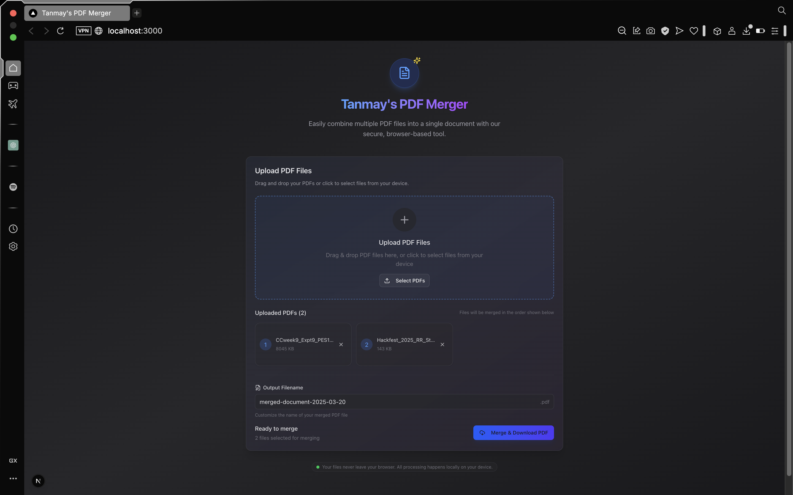

# Tanmay's PDF Merger

A sleek, modern web application for merging multiple PDF files into a single document. This app runs entirely in your browser - no server uploads required, ensuring your documents stay private and secure.


> **Note:** Replace the placeholder image URL with a screenshot of your application before publishing to GitHub.

## Features

- **Modern Dark UI**: Clean, intuitive dark mode interface with gradient accents
- **Drag-and-Drop**: Easy file uploading with visual feedback
- **Multiple PDF Support**: Merge any number of PDF files seamlessly
- **Custom Filename**: Choose your own filename for the merged document
- **Progress Tracking**: Real-time visual feedback during the merging process
- **100% Client-Side**: Your files never leave your browser for maximum privacy
- **Responsive Design**: Works on desktop and mobile devices

## ScreenShot


## Tech Stack

- **[Next.js 15](https://nextjs.org/)** - React framework
- **[React 19](https://react.dev/)** - UI library
- **[TypeScript](https://www.typescriptlang.org/)** - Type safety
- **[Tailwind CSS](https://tailwindcss.com/)** - Styling
- **[pdf-lib](https://pdf-lib.js.org/)** - PDF manipulation
- **[react-dropzone](https://react-dropzone.js.org/)** - File upload
- **[shadcn/ui](https://ui.shadcn.com/)** - UI components
- **[Lucide](https://lucide.dev/)** - Icons
- **[Sonner](https://sonner.emilkowal.ski/)** - Toast notifications

## Getting Started

### Prerequisites

- Node.js (v18 or higher)
- npm or yarn

### Installation

1. Clone the repository:
   ```bash
   git clone https://github.com/yourusername/tanmays-pdf-merger.git
   cd tanmays-pdf-merger
   ```

2. Install dependencies:
   ```bash
   npm install
   # or
   yarn install
   ```

3. Start the development server:
   ```bash
   npm run dev
   # or
   yarn dev
   ```

4. Open [http://localhost:3000](http://localhost:3000) in your browser to use the application.

## Usage

1. **Upload PDFs**: Drag and drop PDF files onto the upload area or click to select files
2. **Arrange Files**: The files will be merged in the order displayed
3. **Name Your File**: Enter a custom name for your merged PDF file (optional)
4. **Merge**: Click "Merge & Download PDF" button
5. **Download**: Your merged PDF will download automatically

## Building for Production

```bash
npm run build
npm run start
# or
yarn build
yarn start
```

## Deployment

This application can be easily deployed to Vercel, Netlify, or any other static site hosting:

```bash
npm run build
# or
yarn build
```

## Privacy

This application processes all files locally in your browser. No file data is ever uploaded to a server, making it safe for sensitive documents.

## License

MIT

## Author

[Tanmay]((https://github.com/tanmayg1313))

## Acknowledgments

- Built with Next.js, React, and pdf-lib
- UI components from shadcn/ui
- Icons from Lucide
